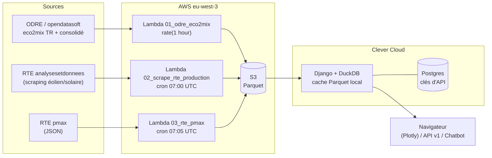

# Architecture

**Buzzelec** — plateforme de visualisation des données électriques françaises (consommation, production par filière, échanges transfrontaliers). Application publiée sur <https://statelec.cleverapps.io/>.

## Vue d'ensemble

## Composants

**Pipeline ETL** (`infrastructure/`) — trois lambdas Python 3.12 déclenchées par CloudWatch Events, qui téléchargent les données sources, les transforment avec pandas et écrivent des fichiers Parquet sur S3. Provisionné par Terraform. Détail : [02-pipeline-etl.md](02-pipeline-etl.md).

**Webapp** (`webapp/`) — application Django 6 qui lit les Parquet via DuckDB (avec un cache local sur disque), rend des graphiques Plotly, expose une API publique JSON (django-ninja) et un chatbot (tool-use sur l'API Mistral). Détail : [04-webapp.md](04-webapp.md).

Les deux composants ne communiquent **que par S3** : aucun appel direct entre les lambdas et la webapp. Les lambdas écrivent, la webapp lit ; le contrat est le schéma des fichiers Parquet ([03-donnees.md](03-donnees.md)).

## Choix structurants

- **Pas de base de données pour les données métier** : les Parquet sur S3 sont la « base », interrogée en SQL par DuckDB. Voir [decisions/001-duckdb-parquet-s3.md](decisions/001-duckdb-parquet-s3.md).
- **Postgres uniquement pour les clés d'API** (une seule table) : le système de fichiers de l'hébergeur est éphémère, il faut un stockage qui survit aux redéploiements. Voir [decisions/002-postgres-render-api-keys.md](decisions/002-postgres-render-api-keys.md) et [decisions/004-hebergement-clever-cloud.md](decisions/004-hebergement-clever-cloud.md).
- **Sessions en cookies signés** (`signed_cookies`) : aucun état de session côté serveur.
- **Auth OIDC générique** (Authlib + discovery) : l'IdP est interchangeable via `OIDC_ISSUER`.

## Stack technique

| Couche | Technologie |
|---|---|
| IaC | Terraform (provider AWS, state S3) |
| ETL | AWS Lambda Python 3.12, pandas, layer AWS SDK Pandas |
| Stockage données | S3 (Parquet), région `eu-west-3` |
| Webapp | Django 6, Gunicorn, WhiteNoise |
| Requêtes données | DuckDB (SQL sur fichiers Parquet) |
| Graphiques | Plotly (chargement AJAX) |
| API publique | django-ninja (Swagger sur `/api/v1/docs`) |
| Chatbot | API Mistral (boucle tool-use) |
| Auth | OIDC (Authlib) |
| Hébergement webapp | Clever Cloud (+ add-on Postgres) |

## Dépôts et branches

Monorepo. `master` = production (auto-déployée sur Clever Cloud via GitHub Actions), `recette` = branche de recette.
